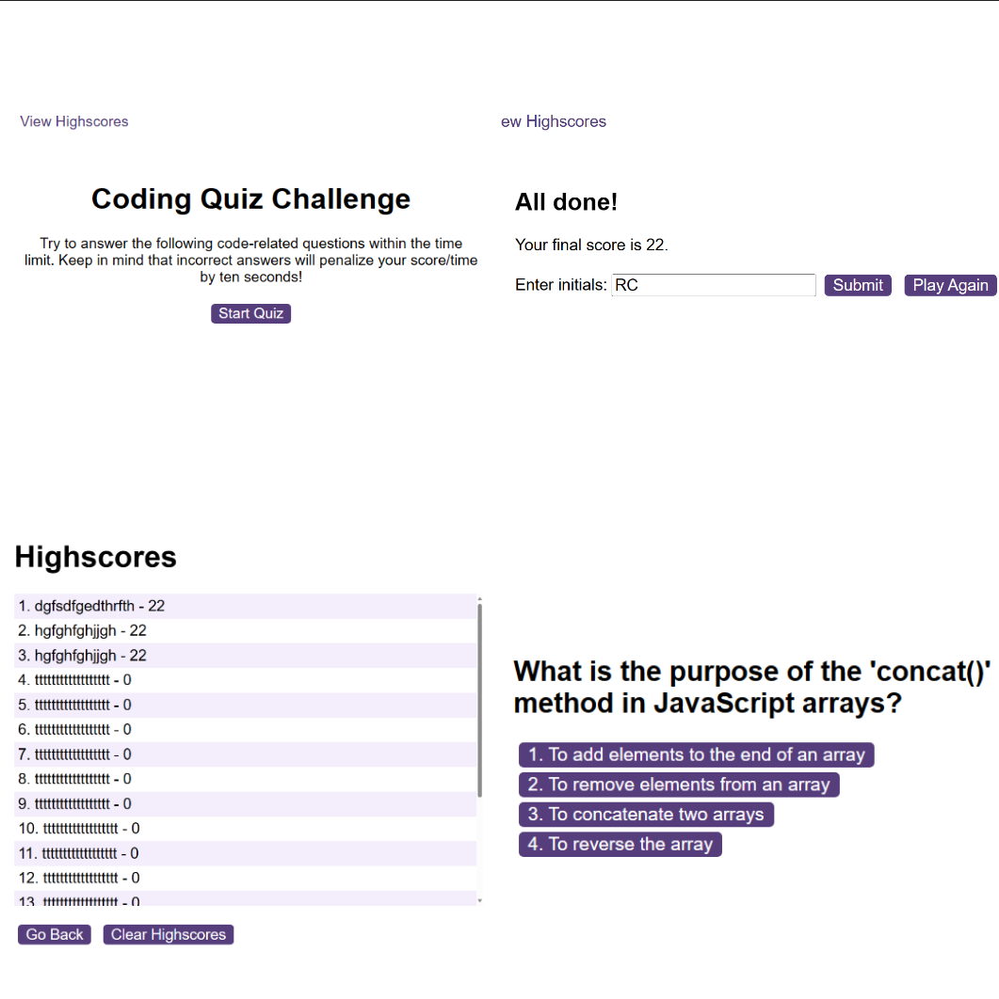

# Quiz-JS 🧩
## A Quiz Game to Test Your JavaScript Knowledge

## Description
Welcome to the JavaScript Fundamentals Challenge! This dynamic quiz features multiple-choice questions, injecting excitement as you race against the clock to accumulate correct answers. Exercise caution, as an incorrect response incurs a time penalty.

The motivation behind creating this quiz is to enhance the enjoyment of learning and practicing JavaScript fundamentals. Notably, it stores your scores, allowing you to track your progress and witness your improvement over time. It serves as an ideal platform to hone your skills. Challenge your friends, compare high scores, and engage in friendly competition to determine who truly excels in their JS knowledge. Let the learning adventure begin!

Please see a full list of features [here](#Features)

## Table of Contents

- [Dev Requirements](#Dev-Requirements)
- [Dev Environment Setup](#Dev-Environment-Setup)
- [Enduser usage instructions](#End-user-usage-instructions)
- [Features](#Features)
- [How to contribute](#How-to-contribute)
- [technologies ](#technologies)
- [Screenshot](#Screenshot)
- [Credits](#credits)
- [License](#license)

## Dev Requirements
Git/GitBash, VS Code, and the source code, of course! 🛠️

## Dev Environment Setup
To get the development environment running:
1. Clone this repo
2. Open the repo folder in VS Code
3. Right-click on `index.html` and open it using the default browser.

- `index.html`: Contains all HTML code for the quiz page
- `highscores.html`: Contains all HTML code for the highscores page
- `assets/js/`: Contains all javaScript files for the webapp
- `assets/css/`: Contains all CSS styling for the webapp
- `assets/images/`: Contains all images used in the webpage

## Enduser usage instructions
There is no special requirements for end users. Simply visit [here](https://rossne99.github.io/Quiz-JS/) To play my Quiz

## Features
- **Contains of 50 unique questions**
- **Questions are always in a random order, no matter how meany times you play!**
- **Players can save there scores**
- **Race against the timer, when you get a question incorrect you will lose time**
- **Scores are saved so you can see how you are improving over time**

## How to contribute
1. Fork this repository
2. Clone the repository
3. Create a branch for your bug fix or feature
4. Make necessary changes and commit those changes
5. Push changes to GitHub
6. Create a pull request to this repo to submit your changes for review

## Technologies
- **JavaScript**
- **HTML**
- **CSS**

## Screenshot

The following image shows the web application's appearance and functionality:

> **Note**: This is a montage of my quiz.

## Credits 
- **Ross** - Source Code

---

## Licence

MIT License

Copyright (c) 2023 RossNE99

Permission is hereby granted, free of charge, to any person obtaining a copy
of this software and associated documentation files (the "Software"), to deal
in the Software without restriction, including without limitation the rights
to use, copy, modify, merge, publish, distribute, sublicense, and/or sell
copies of the Software, and to permit persons to whom the Software is
furnished to do so, subject to the following conditions:

The above copyright notice and this permission notice shall be included in all
copies or substantial portions of the Software.

THE SOFTWARE IS PROVIDED "AS IS", WITHOUT WARRANTY OF ANY KIND, EXPRESS OR
IMPLIED, INCLUDING BUT NOT LIMITED TO THE WARRANTIES OF MERCHANTABILITY,
FITNESS FOR A PARTICULAR PURPOSE AND NONINFRINGEMENT. IN NO EVENT SHALL THE
AUTHORS OR COPYRIGHT HOLDERS BE LIABLE FOR ANY CLAIM, DAMAGES OR OTHER
LIABILITY, WHETHER IN AN ACTION OF CONTRACT, TORT OR OTHERWISE, ARISING FROM,
OUT OF OR IN CONNECTION WITH THE SOFTWARE OR THE USE OR OTHER DEALINGS IN THE
SOFTWARE.